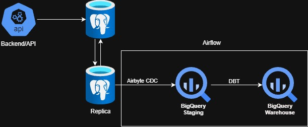

# Pokémon Ability FastAPI Service

## Overview

This project is a **FastAPI-based microservice** that retrieves Pokémon ability data from the public **PokeAPI**, normalizes the `effect_entries` field, stores it in a relational database, and returns a structured JSON response.


---

## Features

- FastAPI (Python 3.10+)
- Async HTTP calls to external API (PokeAPI)
- PostgreSQL database with normalized schema
- Docker & Docker Compose support

---

## Tech Stack

| Component        | Technology |
|------------------|------------|
| API Framework    | FastAPI |
| Language         | Python 3.10 |
| HTTP Client      | httpx (async) |
| Database         | PostgreSQL |
| ORM              | SQLAlchemy |
| Containerization | Docker, Docker Compose |
| ASGI Server      | Uvicorn |

---

## Project Structure

```
.
├── app
│   ├── main.py          # FastAPI entry point
│   ├── database.py      # Database connection
│   ├── models.py        # SQLAlchemy models
│   ├── schemas.py       # Pydantic schemas
│   └── services.py      # External API logic
├── Dockerfile
├── docker-compose.yml
├── requirements.txt
└── README.md
```

---

## API Flow

1. Client sends JSON input containing:
   - `raw_id`
   - `user_id`
   - `pokemon_ability_id`
2. Service calls **PokeAPI**
3. `effect_entries` are normalized
4. Data is stored in PostgreSQL
5. API returns:
   - raw_id
   - user_id
   - normalized effect entries
   - list of Pokémon with the ability

---

## Database DDL

**Table:** `pokemon_ability_raw`

```
create table public.pokemon_ability_raw
(
    id                 serial primary key,
    raw_id             varchar(13),
    user_id            varchar(7),
    pokemon_ability_id integer,
    raw_response       json,
    created_at         timestamp default now()
);
```

**Table:** `pokemon_ability_response`

```
create table public.pokemon_ability_response
(
    id                 serial primary key,
    raw_id             varchar(13),
    user_id            varchar(7),
    pokemon_ability_id integer,
    effect             text,
    language           json,
    short_effect       text,
    created_at         timestamp default now()
);
```

---

## API Endpoint

### `POST /ability`

#### Request Body

```json
{
  "raw_id": "7dsa8d7sa9dsa",
  "user_id": "5199434",
  "pokemon_ability_id": 150
}
```

#### Response Example

```json
{
  "raw_id": "7dsa8d7sa9dsa",
  "user_id": "5199434",
  "returned_entries": [
    {
      "effect": "This Pokémon transforms into a random opponent...",
      "language": {
        "name": "en",
        "url": "https://pokeapi.co/api/v2/language/9/"
      },
      "short_effect": "Transforms upon entering battle."
    }
  ],
  "pokemon_list": ["ditto"]
}
```

---

## Running the Project (Docker)

### Prerequisites
- Docker
- Docker Compose

### Build & Run

```bash
docker-compose up --build
```

API will be available at:
```
http://localhost:8000
```

Swagger UI:
```
http://localhost:8000/docs
```

---

## Running Locally (Without Docker)

```bash
pip install -r requirements.txt
uvicorn app.main:app --reload
```

---

## Design Decisions

- **FastAPI** chosen for async support and built-in documentation
- **PostgreSQL** used for structured and scalable data storage
- **SQLAlchemy ORM** for database abstraction
- **Docker** ensures reproducibility and portability
- **Async HTTP calls** improve performance when calling external APIs

---


## Data Warehouse Architecture



- The API service stores the raw data in a postgreSQL database (ODS) and the database will be replicated (logical replication / WAL)
- Airflow used to orchestrate the ETL pipeline (ELT)
- Airbyte used to ingest data from the ODS to the RAW in Bigquery using CDC method
- DBT used to build the data warehouse

---